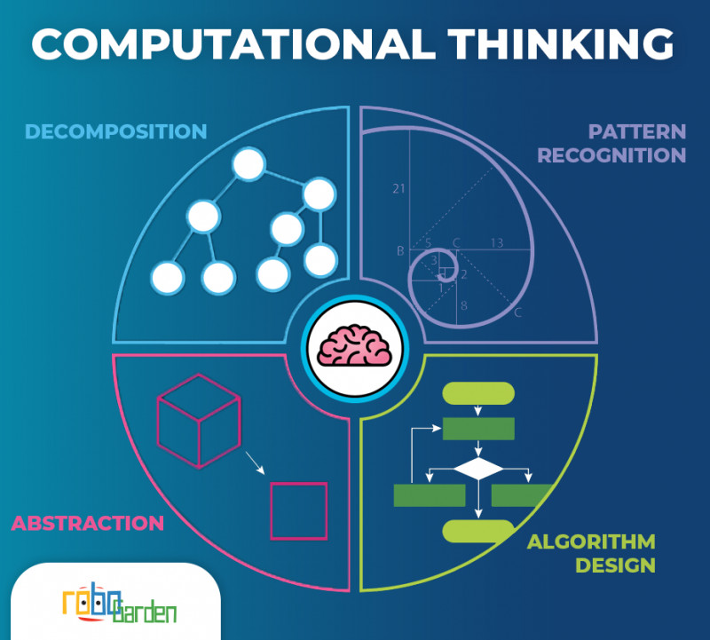

# **Computational Thinking**

## **What is computational thinking?**

**Computational thinking** là một kĩ thuật trong khoa học máy tính để giải quyết các bài toán từ đơn giản, phức tạp, tới những bài toán không rõ ràng yêu cầu trong một thời gian ngắn. Computational thinking tập hợp nhiều bước nhỏ nhằm mục đích tìm ra cách giải quyết các bài toán phức tạp một cách hiệu quả.

## **Các bước trong Computational thinking gồm:**

### **Phân rã bài toán:**
Khi tiếp cận một bài toán khó, không nên cố gắng giải bài toán khó đó ngay lập tức, mà hãy chia ra thành các bài toán nhỏ hơn để giải quyết.

### **Nhận diện bài toán:**
Sau khi phân rã thành các bài toán nhỏ, thường bài toán nhỏ sẽ dễ dàng giải quyết hơn bài toán lớn, một số bài toán nhỏ sẽ có nhiều điểm tương đồng với nhau. Khi một bài toán nhỏ đã được giải trước đó thì có thể tái sử dụng để giải quyết các bài toán nhỏ khác.

### **Trừu tượng hóa bài toán:**
Tìm cách giải tổng quát bài toán trong mọi trường hợp có thể xảy ra là một giải pháp điên rồi. Thay vào đó hãy tìm ra những vấn đề cần giải quyết và những vẫn đề cần bỏ qua. Việc làm này sẽ làm cho bài toán đỡ bị rối, làm bài toán trở nên đơn giản nhất có thể và có thể giải quyết nhiều bài toán cũng một lúc.

### **Thiết kế thuật toán:**
Cuối cùng, khi bài toán trở nên đơn giản hơn nhiều, chúng ta có thể bắt đầu tìm giải thuật cho bài toán đó. Đây là bước đòi hỏi có kinh nghiệm trong việc thiết kế thuật toán, sao cho bài toán được giải quyết đơn giản nhất có thể.

---
## **Ví dụ minh họa**
Bài toán tự nấu mỳ ăn liền xúc xích.
### **Phân rã bài toán:**
- Kiếm gói mỳ.
- Kiếm xúc xích.
- Kiếm nước nóng.
- Kiếm bát đũa.
### **Nhận diện bài toán:**
- Kiếm gói mỳ: có thể tự sản xuất gói mỳ, hoặc đi mua gói mỳ làm sẵn.
- Kiếm xúc xích: đây là bài toán tương tự như bài toán kiếm gói mỳ trước đó, do đó sử dụng phương pháp đã giải bài toán đó: sản xuất xúc xích hoặc đi mua xúc xích.
- Kiếm nước nóng: là bài toán làm nóng chất lỏng, có thể sử dụng các phương pháp như dùng bình nước siêu tốc làm nóng nước hoặc đi mua nước nóng.
- Kiếm bát đũa: sử dụng bát đũa có sẵn hoặc đi mua bát đũa.
### **Trừu tượng hóa bài toán:**
- Kiếm gói mỳ: chỉ quan tấm đó là sẽ kiếm một gói mỳ có mùi vị gì, đảm bảo chất lượng, chưa hết hạn sử dụng, không quan trọng loại mỳ nào, nước nào sản xuất, hay hàm lượng calo trong gói mỳ là bao nhiêu...
- Kiếm xúc xích: tương tự bài toán kiếm gói mỳ.
- Kiếm nước nóng: chỉ quan tâm tới nguồn nước có sạch không, nước có đủ nóng để nấu chín gói mỳ hay không, không quan tâm độ tinh khiết của nước, hàm lượng khoáng trong nước là bao nhiêu,...
- Kiếm bát đũa: chỉ quan tâm bát đũa có sạch không, có đủ kích thước để bỏ gói mỳ vào không, không quan trọng bát đũa do nước nào sản xuất, hay độ bền của bát đã là bao lâu.
### **Thiết kế thuật toán:**
- Bài toán gói mỳ, xúc xích, bát đũa có thể giải quyết đơn giản vấn đề bằng cách ra siêu thị mua để đảm bảo chất lượng, mua gói mỳ loại đóng trong bát hoặc ly sẵn, xúc xích mua loại đóng bao bì có kiểm chứng của cơ quan có thẩm quyền.
- Bài toán nước nóng: có thể sử dụng nước nóng ngay tại siêu thị và ăn mỳ ngay trong siêu thị.
- `=>` Vậy bài toán có thể đơn giản là ra siêu thị mua và ăn ngay tại siêu thị. 